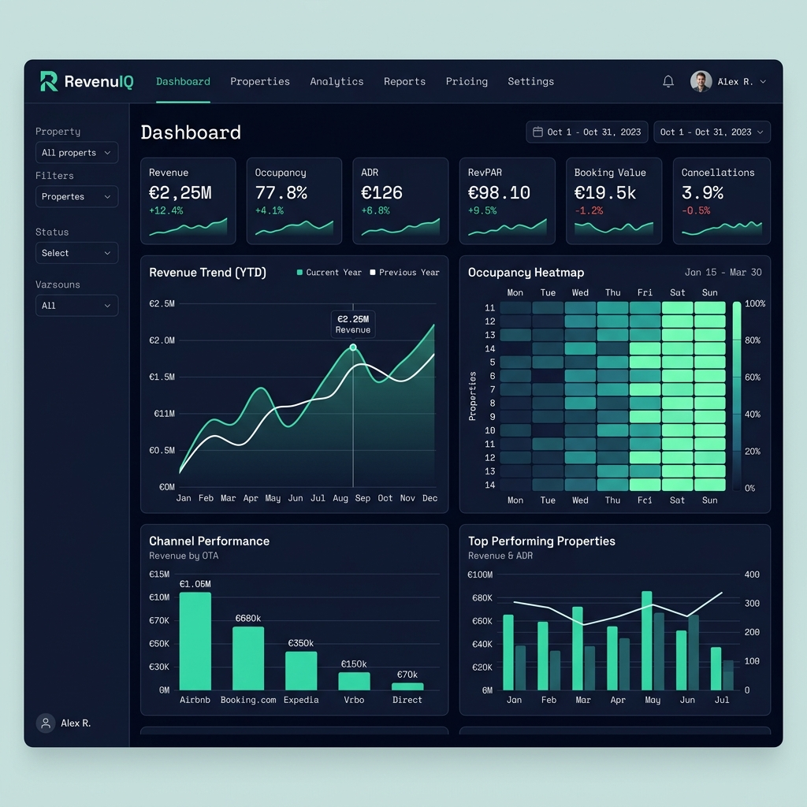

# ✈️ RevenuePilot — STR Revenue Intelligence Platform

> End-to-end Revenue Management analytics system for a 50-unit short-term rental portfolio. Built to demonstrate applied ML, data engineering and business intelligence in hospitality.

<p align="center">
  <a href="https://mikelcerio.github.io/revenue-pilot-str-analytics/">
    
  </a>
</p>

<p align="center">
  <a href="https://mikelcerio.github.io/revenue-pilot-str-analytics/"><strong>🔗 Portfolio Page</strong></a> ·
  <a href="https://mikelcerio.github.io/revenue-pilot-str-analytics/outputs/RevenuePilot_Dashboard.html"><strong>⚡ Dashboard Demo</strong></a> ·
  <a href="https://mikelcerio.github.io/revenue-pilot-str-analytics/outputs/BilbaoMarketMap.html"><strong>🗺️ Market Map</strong></a>
</p>

<p align="center">
  
  
  
  
  
</p>

---

## 📌 Problem Statement

A portfolio of 50 tourist apartments across 5 buildings was operating with:

- **No centralized analytics** — revenue tracked across spreadsheets and three disconnected platforms
- **Static pricing** — the same rate applied regardless of seasonality, demand or lead time
- **No cancellation risk management** — no early warning before a booking dropped
- **No market benchmarking** — no systematic comparison against the local STR market

**Goal:** build a Revenue Management intelligence system that goes from raw booking data to specific, actionable pricing decisions.

---

## 🎯 What This Project Delivers

| Component | Description |
|-----------|-------------|
| 📊 **Power BI model** | Star schema with 40+ DAX measures, documented in `outputs/reports/` |
| 🤖 **ML pipeline** | 3 LightGBM models: demand forecasting, cancellation risk, price recommendation |
| 🗺️ **Market map** | Interactive Leaflet.js map — 1,561 listings from Inside Airbnb open data |
| 🔍 **Review NLP** | Sentiment and topic extraction over 6,298 multilingual guest reviews |
| 📈 **Demo dashboard** | Standalone HTML dashboard, no backend required |
| 🌐 **Landing page** | GitHub Pages site presenting the project |

---

## 📈 Key Results

| Metric | Value | Source |
|--------|-------|--------|
| Bookings analysed | 34,167 (2019–2026) | `fact_reservations` |
| Gross revenue analysed | €5.0M (2019–2025) | `01_kpis_summary.md` |
| Reviews processed (NLP) | 6,298 in 5 languages | `fact_reviews` |
| Market listings benchmarked | 1,561 | Inside Airbnb open data |
| Pricing upside identified | €195,786/year | `buildings_vs_market.csv` |
| Occupancy 2024 vs. market | 77.5% vs 47.6% | `01_kpis_summary.md` |
| ADR 2025 | €116.27 | `01_kpis_summary.md` |
| RevPAR 2025 | €85.25 | `01_kpis_summary.md` |

Every figure above is reproducible from the published data. Cost structure and
operating margin are deliberately excluded, so no profitability claims are made
here.

---

## 🚀 Quick Start

The published dataset is the **anonymized star schema** in `data/public/`. The
first script rebuilds the working table the pipeline expects, so the analysis
below runs from a clean clone — no private data required.

```bash
git clone https://github.com/MikelCerio/revenue-pilot-str-analytics
cd revenue-pilot-str-analytics
pip install -r requirements.txt

# 1. Rebuild the working layer from the public star schema
python scripts/00_build_from_public.py

# 2. Analysis pipeline
python scripts/kpis_phase1.py          # ADR, RevPAR, occupancy, ALOS, lead time
python scripts/pricing_phase3.py       # pricing gaps and fill-speed signals
python scripts/powerbi_phase5.py       # star schema export for Power BI
python scripts/benchmark_rm_report.py  # market benchmarking report

# 3. Market analysis from open data
python scripts/airbnb_market_analysis.py
python scripts/build_market_map.py
```

The three HTML files in `outputs/` are self-contained — open them straight in a
browser, no server needed.

### Reproducibility boundary

This repository publishes the **anonymized analytical layer**, not the raw
operational one. That distinction is deliberate, and it means some scripts are
included as source but will not execute from a clone:

| Script | Status | Why |
|--------|--------|-----|
| `etl_phase0.py` | ⛔ needs private input | Reads booking statements and channel-manager exports containing guest data |
| `train_models_phase4.py` | ⛔ needs private input | Trains on the raw unified layer; the resulting models are published separately |
| `gastos_phase6.py` | ⛔ needs private input | Reads cost and financing data, excluded entirely |
| `reviews_nlp_phase8.py` | ⛔ needs private input | Reads raw review exports; its NLP output *is* published |
| `patterns_phase2.py` | ⚠️ partial | Orphan-gap detection needs unit-level granularity that the public export aggregates away |
| `forecast_2026.py` | ⚠️ partial | Needs the trained `.pkl` artefacts — see the companion repo below |

Everything else runs end to end on the public data. The outputs of the scripts
above — trained models, NLP results, reports and figures — are all published, so
the analysis is auditable even where the input is not.

---

## 🗂️ Project Structure

```
revenue-pilot-str-analytics/
├── index.html                     # Landing page (GitHub Pages)
├── assets/                        # CSS, JS, images
├── scripts/
│   ├── 00_build_from_public.py    # Rebuilds the working layer from public data
│   ├── etl_phase0.py              # Raw ingestion & dedup
│   ├── kpis_phase1.py             # ADR, RevPAR, occupancy, ALOS
│   ├── patterns_phase2.py         # Seasonality, events, orphan gaps
│   ├── pricing_phase3.py          # Pricing gaps and elasticity
│   ├── train_models_phase4.py     # LightGBM training
│   ├── powerbi_phase5.py          # Star schema export
│   ├── gastos_phase6.py           # Profitability analysis
│   ├── benchmark_rm_report.py     # Market benchmarking
│   ├── reviews_nlp_phase8.py      # Multilingual review NLP
│   ├── airbnb_market_analysis.py  # Inside Airbnb open-data pipeline
│   ├── build_market_map.py        # Leaflet.js map generator
│   └── forecast_2026.py           # Forward-looking demand forecast
├── data/
│   └── public/                    # Anonymized star schema (52 files, CSV + Parquet)
│       ├── fact_reservations      # 34,167 bookings
│       ├── fact_reviews           # 6,298 reviews with NLP output
│       ├── dim_property           # Buildings A–E, rounded coordinates
│       ├── dim_channel, dim_date, dim_event
│       └── market_*               # Inside Airbnb derived tables
├── outputs/
│   ├── RevenuePilot_Dashboard.html
│   ├── BilbaoMarketMap.html
│   ├── LinkedIn_PostCalendar.html
│   ├── figures/                   # 42 charts (PNG)
│   └── reports/                   # 11 markdown analysis reports
├── notebooks/
│   └── 01_kpis_base.ipynb
├── requirements.txt
└── LICENSE
```

---

## 📊 Power BI Star Schema

```
                    ┌─────────────┐
                    │  dim_date   │
                    └──────┬──────┘
                           │
┌──────────────┐    ┌──────▼───────────┐    ┌──────────────┐
│ dim_property │───▶│ fact_reservations│◀───│ dim_channel  │
└──────────────┘    └──────┬───────────┘    └──────────────┘
                           │
              ┌────────────┼────────────┐
              ▼            ▼            ▼
       fact_reviews  fact_pricing_gap  fact_kpis_monthly
```

Design notes and the full DAX measure catalogue:
[`outputs/reports/09_powerbi_complete_guide.md`](outputs/reports/09_powerbi_complete_guide.md)

---

## 🤖 ML Models

| Model | Task | Algorithm | Test metric (2024) |
|-------|------|-----------|--------------------|
| **A** | Demand forecasting | LightGBM Regressor | MAE ±17.8 pp |
| **B** | Cancellation risk | LightGBM Classifier | ROC-AUC 0.821 |
| **C** | Price recommendation | LightGBM Regressor | MAE ±€43 |

Model C consumes Model A's demand prediction as an input feature — a stacked
pipeline. Training uses a **temporal split** (train 2019–22 / validate 2023 /
test 2024) rather than a random split, to avoid lookahead bias.

**Honest limitation:** Model B has recall 0 at the default 0.5 threshold, caused
by a 1:10 class imbalance. The AUC of 0.821 shows the ranking is sound, so the
model is usable — but only with an operating threshold around 0.25–0.35. This is
documented rather than hidden, and is first on the improvement list.

Full evaluation: [`outputs/reports/04_models_evaluation.md`](outputs/reports/04_models_evaluation.md)
Training code and model artefacts live in a companion repository:
[**str-dynamic-pricing-lgbm**](https://github.com/MikelCerio/str-dynamic-pricing-lgbm)

---

## 🔒 Data Sources & Privacy

This project combines two very different data sources, handled differently.

**1. Market data — public and open**
Benchmarking uses [Inside Airbnb](http://insideairbnb.com) open data (1,561
listings). Publicly available and reproducible by anyone.

**2. Portfolio data — anonymized operational data**
Operational figures come from a real 50-unit short-term rental portfolio and are
published only after a scripted anonymization pass:

- Building and unit names replaced with neutral labels (`A`–`E`, `A-01`)
- Commercial and brand names stripped from every file, including free-text reviews
- Guest names, contact details and staff names removed; guest identifiers hashed
- Coordinates rounded to 3 decimals (~110 m) — the same level of displacement
  Inside Airbnb applies to its own listings
- Internal P&L, cost structure and financing data excluded entirely

Anonymization is enforced by script rather than by hand, and the build runs an
automated check that **fails** if any identifying term reaches the public export.
Ratios and distributions are preserved so the analysis remains valid.

---

## 🛠️ Stack

`Python 3.11` · `pandas` · `LightGBM` · `scikit-learn` · `Plotly` · `Leaflet.js`
· `Power BI` / `DAX` · `Jupyter`

---

## 👤 Author

**Mikel Cerio** — Revenue Manager & Data Analyst
Microsoft Certified: Fabric Analytics Engineer Associate (DP-600)

- 💼 [LinkedIn](https://linkedin.com/in/mikelcerio)
- 🐙 [GitHub](https://github.com/MikelCerio)
- 📧 mikelcchinchurreta@gmail.com

---

## 📄 License

MIT — see [LICENSE](LICENSE). Data files are anonymized derivatives published for
demonstration purposes.
